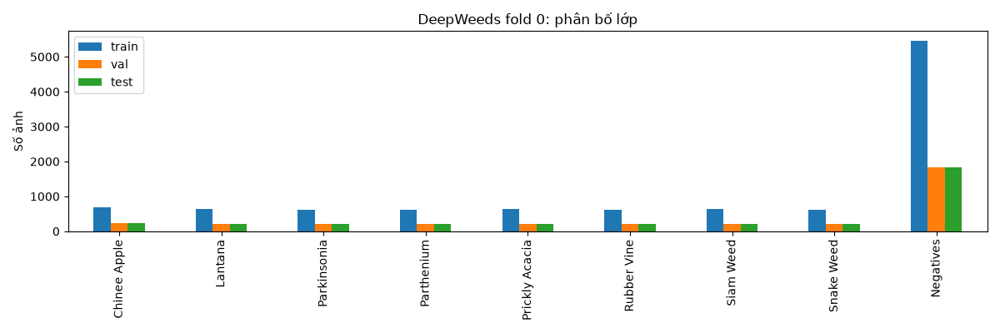
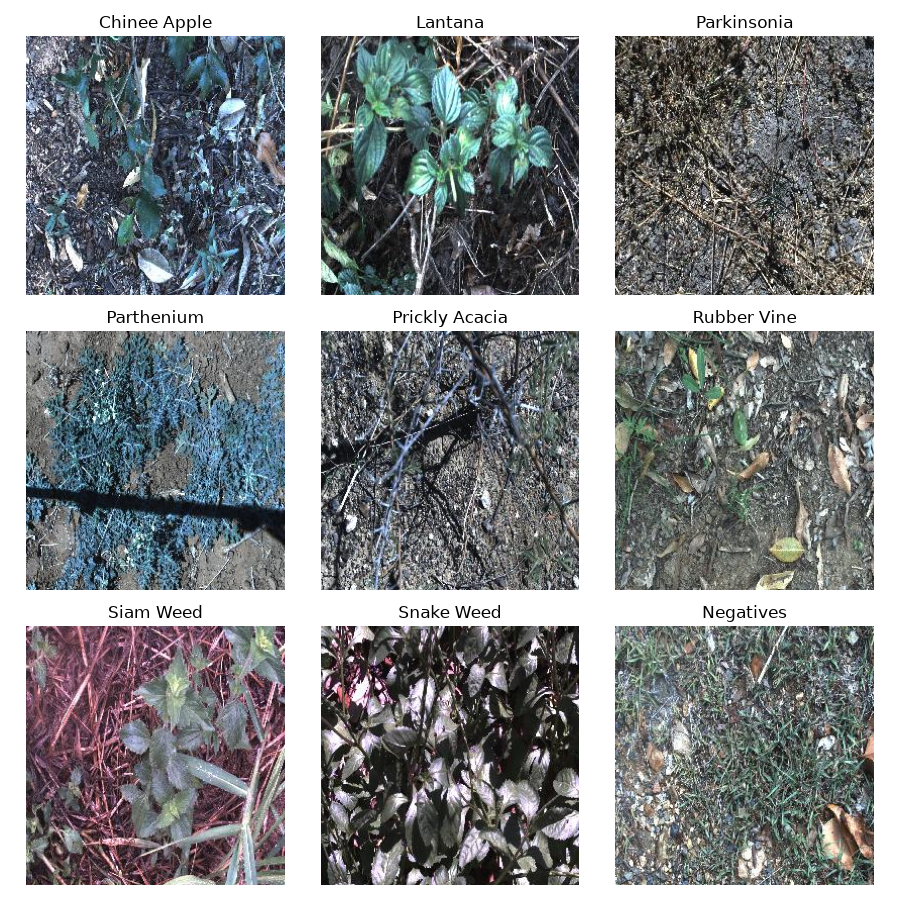
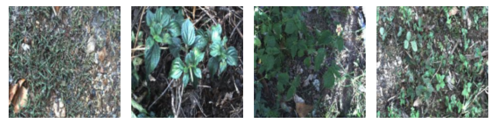
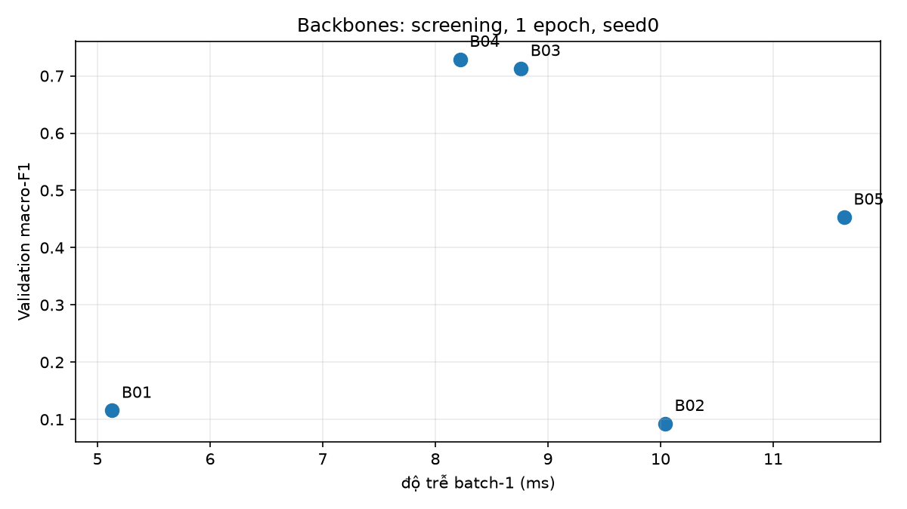
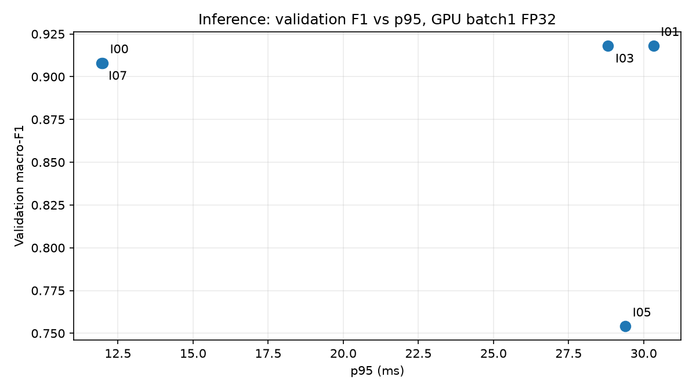
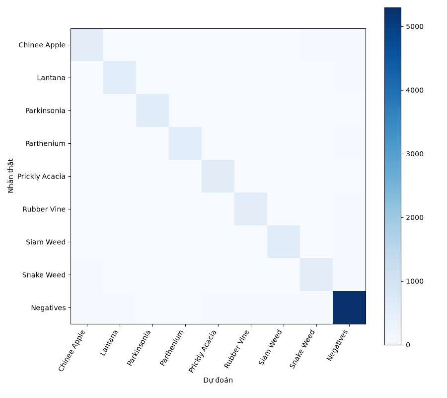
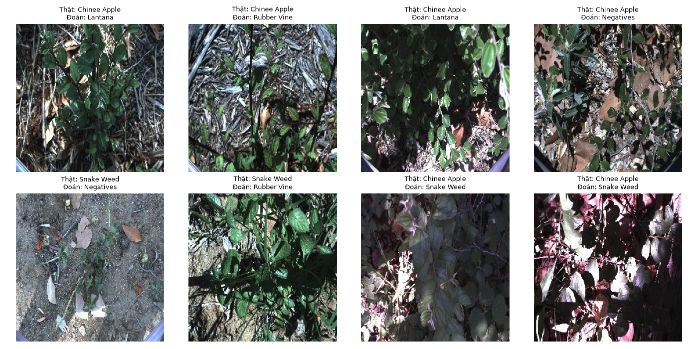
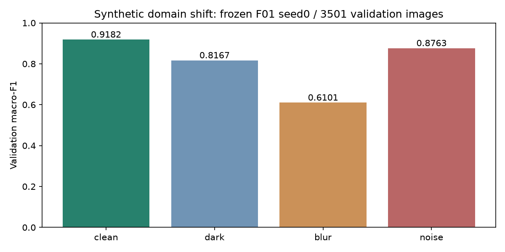
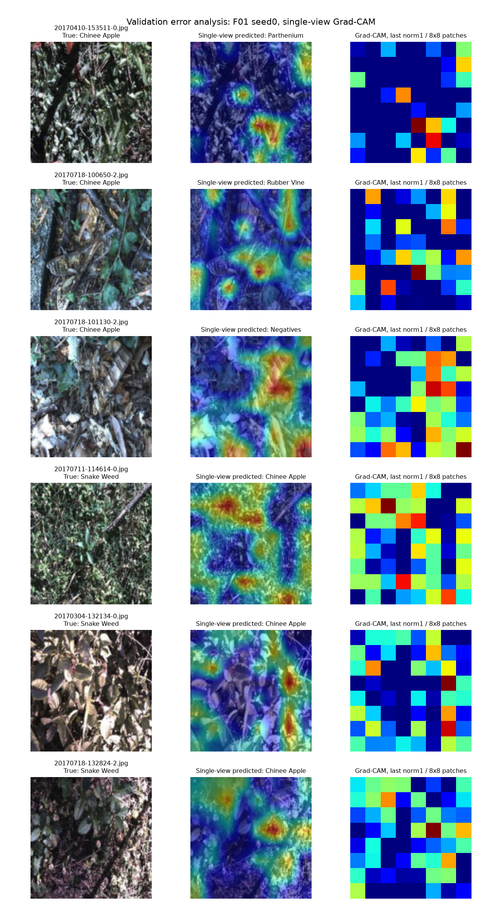

# Lab Day 2 — Nguyễn Văn Thân (02859)

## 1. Tóm tắt

DeepWeeds gồm 9 lớp, đánh giá trên fold 0 gốc. Đã khảo sát 5 backbone, 3 trục training và một kết hợp; so sánh 4 phương pháp suy luận ngoài 1-view.

Cấu hình chọn trên validation: **DeiT tiny ImageNet `fb_in1k`, 128 px, finetune toàn bộ, basic crop/flip, CE, 12 epoch, FP32; hflip gộp logits và temperature scaling**.

Test 3 seed (0,1,2): **top-1 93.67% ± 0.30 điểm phần trăm; macro-F1 0.9139 ± 0.0044**.

So với T00 + I00, Δ macro-F1 = **+0.0035**, nhỏ hơn std lớn hơn **0.0058**; chưa chứng minh cải thiện chắc chắn.

Độ trễ bổ sung của F01 gồm forward + gộp logits + softmax/temperature: p95 **26.68 ms**, batch 1 trên GTX 1650; chưa gồm decode/resize/chuyển ảnh lên GPU.

## 2. Dữ liệu và thiết lập

### 2.1. Fold và kiểm tra dữ liệu

Giữ nguyên train/val/test CSV fold 0: **10.501 / 3.501 / 3.507** ảnh; giao từng cặp bằng 0, hợp đúng **17.509** ảnh. Chỉ train dùng để cập nhật trọng số. Mọi lựa chọn/checkpoint/T fit trên val; test chỉ chạy sau chốt lựa chọn, một lần cho mỗi cấu hình/seed (các view nằm trong cùng lần đánh giá).

| Lớp | train | val | test | Catalog | Table 1 (tài liệu lab) |
|---|---|---|---|---|---|
| Chinee apple | 675 | 225 | 226 | 1125 | 1125 |
| Lantana | 637 | 213 | 213 | 1064 | 1064 |
| Parkinsonia | 618 | 206 | 207 | 1031 | 1031 |
| Parthenium | 613 | 204 | 205 | 1022 | 1022 |
| Prickly acacia | 637 | 212 | 213 | 1062 | 1062 |
| Rubber vine | 605 | 202 | 202 | 1009 | 1009 |
| Siam weed | 644 | 215 | 215 | 1074 | 1074 |
| Snake weed | 609 | 203 | 204 | 1016 | 1016 |
| Negative | 5463 | 1821 | 1822 | 9106 | 9106 |

Catalog khớp Table 1. CSV fold gốc có đúng một khác biệt ở train: `20170714-110407-3.jpg` mang Label 0, catalog Label 1; giữ nguyên fold theo S1, không sửa/lọc ảnh. Vì thế tổng fold của lớp 0/1 là 1.126/1.063, còn catalog là 1.125/1.064. Kiểm tra đầy đủ: [split_check.json](evidence/runs/split_check.json).

Negative chiếm 9.106/17.509 ≈ 52%; các lớp còn lại khoảng 1.009–1.125 ảnh. Do đó macro-F1 là tiêu chí chọn chính; top-1 phải đọc kèm F1/recall từng lớp.

### 2.2. Pipeline, phần cứng và tái lập

Loss kiểm tra đầu 2,1104 so với ln(9)=2,1972; overfit batch nhỏ đạt **0,0131 sau 16 bước**. Sáu kiểm tra focal γ=0, LS ε=0, CutMix diện tích, Mixup nhãn, fuse Conv-BN và temperature đều pass. Đây là kiểm tra chức năng; không phải các thí nghiệm training độc lập.

Phần cứng: Windows 11 / Ryzen 5 6600HS / RAM 16 GB / **NVIDIA GeForce GTX 1650 4 GB**. Python 3.13.13, torch 2.7.1+cu126, torchvision 0.22.1+cu126, timm 1.0.30, NumPy 2.5.1. Phiên bản phụ thuộc đầy đủ ở [environment.json](evidence/environment.json) và [requirements-local.txt](requirements-local.txt).

Probe forward/backward/AdamW trên 5 mạng chọn **batch 64, FP32, NCHW, 2 workers, cuDNN benchmark tắt**, dùng chung cho mọi cấu hình. FP16 không nhanh hơn trên máy này; ConvNeXt FP16 batch64 có loss không hữu hạn nên loại. CUDA/cuDNN ở Colab khác máy này, vì vậy không quy mọi lỗi FIND về một nguyên nhân duy nhất.

Công thức nền: RandomResizedCrop(128, scale 0,6–1,0) + hflip; eval resize 146 rồi center crop 128, Normalize ImageNet. AdamW LR backbone 0.0001, head 0.001, weight decay 0.05, warmup 0.1 epoch + cosine. Backbone norm/bias không decay; nhóm head giữ decay theo bộ khung 3 nhóm. Không EMA/Mixup/sampler cân bằng. `eval()` và inference_mode dùng khi đánh giá.

Khảo sát seed0, 1 epoch; chung kết 12 epoch cho đủ 3 seed. Lượt nghiên cứu chính mất **36,18 phút** (không tính cài đặt/tải weights/probe); các phép đo/giải thích bổ sung có log riêng. Không dùng benchmark này để hứa cùng thời gian trên Colab.

## 3. So sánh backbone

| exp_id | backbone | tag trọng số | #params (M) | GMAC | macro-F1 val | top-1 val | train/epoch (s) | độ trễ batch-1 (ms) |
|---|---|---|---|---|---|---|---|---|
| B01 | resnet18 | a1_in1k | 11.1800 | 0.5922 | 0.1158 | 0.5284 | 89.1000 | 5.1300 |
| B02 | resnet34 | a1_in1k | 21.2900 | 1.1962 | 0.0929 | 0.5247 | 57.5000 | 10.0400 |
| B03 | convnext_atto | d2_in1k | 3.3800 | 0.1786 | 0.7128 | 0.7969 | 82.9000 | 8.7600 |
| B04 | deit_tiny_patch16_224 | fb_in1k | 5.5000 | 0.3545 | 0.7289 | 0.8066 | 54.4000 | 8.2200 |
| B05 | mobilenetv3_large_100 | ra_in1k | 4.2100 | 0.0722 | 0.4532 | 0.6084 | 46.9000 | 11.6300 |

Cùng split/seed0, 128 px, 1 epoch, AdamW/crop/flip/CE/FP32; khác kiến trúc và tag pretrained công bố. DeiT tiny đạt F1 **0,7289** so với ConvNeXt atto **0,7128** (Δ=0,0161), thời gian epoch **54,4 so với 82,9 s**. ConvNeXt ít tham số hơn (3,38M so với 5,50M), nhưng DeiT hợp ngân sách local và có F1 val cao hơn nên đi tiếp. MobileNetV3 nhẹ nhất theo GMAC, nhanh nhất theo train/epoch; latency batch1 thực đo không nhất thiết thấp nhất.

ResNet18/34 đạt F1 thấp sau chỉ 1 epoch; chưa đủ để kết luận họ ResNet kém khi hội tụ. GMAC là Conv2d + Linear, **chưa tính attention matmul**, nên số DeiT là cận dưới. Mỗi backbone mới có 1 seed và tag pretrained khác nhau: kết quả là lựa chọn thực dụng trong ngân sách, không phải kiểm định thuần kiến trúc.

## 4. Ablation công thức huấn luyện

| exp_id | trục thay đổi | macro-F1 val | Δ so với mốc | F1 Chinee apple val | F1 Snake weed val |
|---|---|---|---|---|---|
| T01 | A. khởi tạo (frozen) | 0.3343 | -0.3947 | 0.3499 | 0.3448 |
| T03 | B. augmentation (color) | 0.6866 | -0.0423 | 0.5779 | 0.5882 |
| T07 | C. loss (label smoothing) | 0.7258 | -0.0031 | 0.5808 | 0.6221 |
| T14 | kết hợp color + label smoothing | 0.6880 | -0.0409 | 0.5620 | 0.6044 |
| TS00 | nền khảo sát (cùng ngân sách ablation) | 0.7289 | 0.0000 | 0.5950 | 0.6412 |

TS00 là đúng bản chạy B04 dùng lại, cùng 1 epoch/seed0. T01 chỉ đổi finetune→frozen; T03 chỉ đổi basic→color jitter; T07 chỉ đổi CE→LS ε=0,1. Mỗi trục có hai giá trị và so với TS00, không so ablation 1 epoch với T00 12 epoch.

Frozen giảm **0,3947 F1**: thích ứng backbone quan trọng trong chế độ khảo sát này. Color jitter giảm **0,0423**; giả thuyết thay đổi màu mạnh làm khó phân biệt lá khi chưa hội tụ, cần kiểm chứng thêm. LS giảm **0,0031**, không có std khảo sát nên không khẳng định nó có hại chắc chắn. T14 kết hợp color+LS đạt **0,6880**, tăng **0,0014** so với color đơn, nhưng vẫn thấp hơn TS00 **0,0409**; chưa có cộng dồn hữu ích. Hai thành phần này được thử để kiểm tra tương tác, không gọi là những yếu tố tốt nhất.

Công thức thắng giữ nguyên basic + CE + full finetune. T00 và F01 dùng cùng trọng số train ở mỗi seed vì công thức training giống hệt; khác ở suy luận, có provenance trong summary. T00 không phải sáu lần train riêng. Thêm thời gian train từ 1 lên 12 epoch giúp F1 DeiT seed0 từ **0,7289 lên 0,9081** (khác lịch cosine/ngân sách; không quy toàn bộ cho một yếu tố).

## 5. Suy luận và hiệu chuẩn

| exp_id | phương pháp | K | macro-F1 val | top-1 val | ECE val | p50 (ms) | p95 (ms) | p99 (ms) |
|---|---|---|---|---|---|---|---|---|
| I00 | 1-view FP32 | 1 | 0.9081 | 0.9337 | 0.0243 | 8.4480 | 11.9932 | 12.4225 |
| I01 | hflip / mean probability | 2 | 0.9182 | 0.9409 | 0.0172 | 17.2189 | 30.3255 | 31.2615 |
| I03 | hflip / mean logits | 2 | 0.9182 | 0.9406 | 0.0210 | 17.1142 | 28.8160 | 31.3180 |
| I07 | temperature scaling | 1 | 0.9081 | 0.9337 | 0.0054 | 8.5010 | 11.9439 | 14.9491 |
| I05 | ensemble 2 backbones | 2 | 0.7542 | 0.8249 | 0.0786 | 20.2730 | 29.3885 | 32.2208 |

Bốn phương pháp ngoài I00: hflip gộp xác suất (I01), hflip gộp logits (I03), ensemble B04+B03 (I05), temperature scaling (I07). Hflip logits tăng **0,0101 F1 val**; prob/logit chỉ chênh khoảng **0,000004**, không có bằng chứng logits tốt hơn chắc chắn. Quy tắc đã chốt trước test: giữ 1-view nếu gain≤0,001; lấy điểm val cao nhất nếu vượt ngưỡng. Temperature không đổi argmax/F1, giảm ECE I00 **0,0243→0,0054** với T≈1,3548.

Ensemble 0,7542 F1 dùng hai checkpoint **khảo sát 1 epoch**, không tương đương ngân sách model F01 12 epoch. Không dùng số này để kết luận ensemble nói chung kém; nó cũng tốn hai mạng và thêm bộ nhớ.

Bảng suy luận/latency cập nhật bằng phép đo bổ sung: batch1, GPU input 128 px đã sẵn, FP32, **20 warmup + 100 lượt**, synchronize trước/sau từng lượt, gồm forward và gộp/softmax. Latency khảo sát backbone và phép đo forward-only gốc (10 warmup/50 lượt) giữ ở evidence để truy ngược; không trộn hai phạm vi đo. Nghịch đảo p50 là thông lượng tuần tự batch1, không phải throughput batched.

## 6. Chung kết và phân tích lỗi

### F01: hflip logits + temperature (3 seed: [0, 1, 2]; 3507 ảnh)

| Chỉ số | mean ± std |
|---|---|
| top-1 accuracy | 0.9367 ± 0.0030 |
| macro-F1 | 0.9139 ± 0.0044 |
| balanced accuracy | 0.9103 ± 0.0051 |
| ECE (15 bin) | 0.0090 ± 0.0025 |
| NLL | 0.1918 ± 0.0032 |

| Lớp | Precision | Recall | F1 | Số ảnh |
|---|---|---|---|---|
| Chinee apple | 0.882 ± 0.013 | 0.792 ± 0.035 | 0.834 ± 0.019 | 226 |
| Lantana | 0.897 ± 0.013 | 0.901 ± 0.019 | 0.899 ± 0.005 | 213 |
| Parkinsonia | 0.948 ± 0.018 | 0.982 ± 0.015 | 0.964 ± 0.004 | 207 |
| Parthenium | 0.953 ± 0.017 | 0.911 ± 0.007 | 0.931 ± 0.007 | 205 |
| Prickly acacia | 0.914 ± 0.016 | 0.911 ± 0.019 | 0.912 ± 0.007 | 213 |
| Rubber vine | 0.935 ± 0.014 | 0.904 ± 0.012 | 0.919 ± 0.002 | 202 |
| Siam weed | 0.945 ± 0.006 | 0.933 ± 0.012 | 0.939 ± 0.009 | 215 |
| Snake weed | 0.837 ± 0.036 | 0.889 ± 0.015 | 0.862 ± 0.017 | 204 |
| Negative | 0.958 ± 0.002 | 0.969 ± 0.000 | 0.964 ± 0.001 | 1822 |

### T00 + I00: baseline single-view (3 seed: [0, 1, 2]; 3507 ảnh)

| Chỉ số | mean ± std |
|---|---|
| top-1 accuracy | 0.9336 ± 0.0045 |
| macro-F1 | 0.9104 ± 0.0058 |
| balanced accuracy | 0.9070 ± 0.0062 |
| ECE (15 bin) | 0.0255 ± 0.0020 |
| NLL | 0.2175 ± 0.0047 |

| Lớp | Precision | Recall | F1 | Số ảnh |
|---|---|---|---|---|
| Chinee apple | 0.881 ± 0.014 | 0.776 ± 0.022 | 0.825 ± 0.011 | 226 |
| Lantana | 0.894 ± 0.012 | 0.908 ± 0.014 | 0.901 ± 0.008 | 213 |
| Parkinsonia | 0.940 ± 0.018 | 0.981 ± 0.013 | 0.960 ± 0.007 | 207 |
| Parthenium | 0.949 ± 0.012 | 0.907 ± 0.015 | 0.928 ± 0.005 | 205 |
| Prickly acacia | 0.911 ± 0.025 | 0.911 ± 0.019 | 0.911 ± 0.009 | 213 |
| Rubber vine | 0.932 ± 0.009 | 0.899 ± 0.012 | 0.915 ± 0.004 | 202 |
| Siam weed | 0.941 ± 0.006 | 0.935 ± 0.005 | 0.938 ± 0.001 | 215 |
| Snake weed | 0.833 ± 0.027 | 0.881 ± 0.012 | 0.856 ± 0.010 | 204 |
| Negative | 0.955 ± 0.004 | 0.966 ± 0.003 | 0.961 ± 0.003 | 1822 |

T fit riêng trên val theo seed0/1/2: **1.3199, 1.3103, 1.2785**. Test ECE trước/sau: **0.0214 ± 0.0025 → 0.0090 ± 0.0025**. Gap F1 val/test = **0.0030**. Tất cả 6 manifest cuối có status complete và 3.507 ảnh; CSV uncal dùng cùng lượt logits đã lưu, không chạy test mới.

Ma trận cộng 3 seed (cùng 3.507 ảnh được dự đoán ba lần, **không phải 10.521 ảnh độc lập**); hàng thật/cột dự đoán. Các nhầm lẫn lớn:

| Số lần qua 3 seed | Thật | Dự đoán |
|---|---|---|
| 58 | Chinee apple | Negative |
| 56 | Chinee apple | Snake weed |
| 44 | Rubber vine | Negative |
| 33 | Lantana | Negative |
| 28 | Negative | Snake weed |
| 28 | Negative | Lantana |

Cặp Chinee apple→Snake weed: **56/678** lượt (8.26%); chiều ngược **24/612** (3.92%). Đây không phải nguồn sai duy nhất; cần đọc cả nhầm với Negative và các loài lá tương tự.

Trong các ảnh sai hiển thị, Chinee apple có thể nhỏ, nhiều lá/cành che lấp và bóng đổ; Snake weed có nền đất lớn hoặc lẫn nhiều thực vật. Hai ví dụ Chinee apple→Snake weed có ánh sáng/tông hồng khác ảnh lá xanh. Giả thuyết: giảm xuống 128 px làm mất chi tiết hình thái và tín hiệu nền/màu có thể chi phối. Ảnh minh họa không đủ xác nhận nhân quả; không sửa nhãn hoặc cấu hình dựa vào quan sát test.

### 6.1. Đường cong training

[F01 seed0](curves/F01_seed0.png), [seed1](curves/F01_seed1.png), [seed2](curves/F01_seed2.png); tất cả B/T/TS có ảnh và CSV riêng. Seed0: train loss giảm **0,8791→0,0438**, val loss **0,5563→0,2257**; F1 val dao động (epoch5 0,8801 xuống epoch6 0,8632) rồi tốt nhất epoch11 0,9081, epoch12 0,9074. Khoảng train/val loss cuối khá lớn gợi ý overfit; chọn checkpoint bằng macro-F1 val, không lấy epoch cuối mặc định. Seed1/2 chọn epoch12/10. Đồ thị 1 điểm của khảo sát chỉ chứng minh lần chạy, không cho phép kết luận tốc độ hội tụ.

## 7. Kết luận và khuyến nghị

F01 đạt macro-F1 test 0.9139 ± 0.0044; Δ so mốc +0.0035 < std 0.0058, nên mức tăng quan sát còn trong nhiễu. Trong khảo sát có kiểm soát, finetune backbone có tác động lớn nhất (**+0,3947 so frozen**); khác biệt backbone tốt nhất với thứ hai nhỏ hơn (**0,0161**), TTA cải thiện val **0,0101**. Tăng ngân sách train có thay đổi lớn (**+0,1792**, kèm đổi lịch LR), nhưng các phép so không cùng điều kiện nên không xếp hạng đóng góp nhân quả chung.

Với GPU khai báo và ngân sách **30–100 ms cho model**, chọn F01 hflip+T: p95 26.68 ms và F1 test 0.9139. Nếu ngân sách end-to-end chặt hoặc GPU yếu hơn, T00 1-view có F1 test 0.9104, ít chi phí hơn; phải đo cả camera/decode/resize/H2D trước triển khai. Không suy độ trễ GTX 1650 sang Jetson/robot khác. F01 phù hợp ngoại tuyến hoặc hệ thống đủ ngân sách; độ tin cậy nên kèm ngưỡng từ validation riêng của môi trường triển khai.

## 8. Thí nghiệm bổ sung trên validation

### 8.1. Lệch phân phối nhân tạo

Cố định F01 seed0 và T đã fit trên val sạch; **không train/thích ứng/refit T**, không dùng test. Đánh giá toàn bộ 3.501 ảnh val ở 4 điều kiện: sạch; brightness×0,55; Gaussian blur radius1,5 ở ảnh gốc 256px; Gaussian noise σ20/255, seed20261005+row. Hflip logits giữ nguyên. Đây là kiểm tra độ bền mô tả, không chọn lại model.

| condition | n | macro_f1 | top1 | ece_before | ece_after |
|---|---|---|---|---|---|
| clean | 3501 | 0.9182 | 0.9406 | 0.0210 | 0.0076 |
| dark | 3501 | 0.8167 | 0.8486 | 0.0595 | 0.0260 |
| blur | 3501 | 0.6101 | 0.7506 | 0.1703 | 0.1410 |
| noise | 3501 | 0.8763 | 0.9109 | 0.0368 | 0.0175 |

F1 giảm từ **0,9182** xuống **0,8167** khi tối (−0,1015), **0,6101** khi mờ (−0,3081), **0,8763** khi nhiễu (−0,0419); điều kiện mờ ảnh hưởng lớn nhất trong ba mức đã chọn. T sạch giảm ECE cả ba miền, nhưng ECE sau hiệu chuẩn khi mờ vẫn **0,1410**, lớn hơn **0,0076** ở sạch. Ánh sáng/chi tiết/nhiễu có thể làm giảm chất lượng dù cùng loài/ảnh. Chỉ 1 seed và corruptions nhân tạo, không thay thế tập đánh giá theo địa điểm/mùa hay đảm bảo calibration ở mọi miền lệch. Xem CSV đầy đủ và protocol ở `evidence/extras/`.

### 8.2. Giải thích bằng Grad-CAM

Sáu lỗi val (3 Chinee apple, 3 Snake weed) chọn theo thứ tự file, không cherry-pick theo heatmap. Grad-CAM cho lớp dự đoán **single-view**, hook `blocks[-1].norm1` trước attention cuối, bỏ CLS, reshape 8×8 patch, trọng số bằng gradient trung bình, ReLU và normalize. Đã kiểm tra gradient hữu hạn/khác0; label single-view và TTA ghi riêng. Bản đồ mức patch thô, chỉ gợi ý vùng nhạy với score; không phải mặt nạ cỏ/định vị đúng và không chứng minh model đã hiểu hình thái.

Ví dụ `20170410-153511-0.jpg` (Chinee apple→Parthenium) có phản hồi lớn ở nhóm lá nửa dưới và mép phải; `20170718-100650-2.jpg` (→Rubber vine) phản hồi rải trên cả lá/cành; `20170711-114614-0.jpg` (Snake weed→Chinee apple) nổi vùng lá phía trên trái. Vùng chú ý rộng trong nền nhiều thực vật phù hợp giả thuyết thiếu chi tiết phân biệt ở128px, nhưng không chứng minh nguyên nhân. Không dùng quan sát này để đổi cấu hình test.

## 9. Hạn chế và phụ lục

Một fold, 3 seed chung kết nhưng chỉ 1 seed khảo sát; 1 epoch sàng lọc có thể đổi thứ hạng khi hội tụ. Các ablation color/LS chưa có std. Không khảo sát scratch/CutMix/focal trong lượt chính, chỉ có unit checks chức năng. Không chạy nhiều fold, distillation, adaptation hoặc ONNX; không nhận các điểm thưởng này.

Fold ngẫu nhiên không theo địa điểm có thể cho test lạc quan; chưa kiểm chứng dữ liệu thật theo mùa/camera. Pretrained tags khác nhau và giảm128px khiến so với bài báo chỉ tham khảo. Recall Chinee apple 79,2% còn dưới mốc 88,5%; Snake weed 88,9% gần mốc 88,8% của tài liệu, điều kiện bài báo khoảng100epoch và 5fold khác thí nghiệm này.

Các sự cố đã sửa trước lượt chính: khác biệt catalog/fold nhãn, numpy bool JSON và CUDA/cuDNN/precision. Probe FP16 không hữu hạn được ghi, không thay bằng số đẹp. Sau khi mở test không có huấn luyện/tuning/test mới; chỉ đọc CSV cũ để hoàn thiện sản phẩm và thêm thí nghiệm val riêng.

`eval.py` gốc tự chấm **10/20 cho mục I**, chưa phải điểm toàn bài. A–H và điểm thưởng cần giảng viên đánh giá minh chứng; không cam kết điểm tối đa. Muốn nâng model ở nghiên cứu tiếp theo cần split/test độc lập mới, không tiếp tục chọn cấu hình trên test đã mở.

Danh mục cấu hình/log: [evidence/runs/](evidence/runs/); workbook [results.xlsx](results.xlsx); hướng dẫn tái lập [README.md](README.md); đối chiếu rubric [RUBRIC_EVIDENCE.md](RUBRIC_EVIDENCE.md). Mọi file có SHA-256 trong [manifest.json](manifest.json). Tài liệu gốc: [README lớp](evidence/lab_docs/README.md), [GUIDE](evidence/lab_docs/GUIDE.md), [RUBRIC](evidence/lab_docs/RUBRIC.md).

